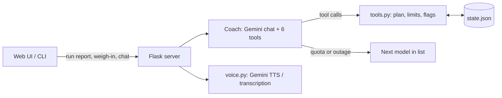

# Sergeant Pace

A running coach with a drill sergeant's mouth and a physiotherapist's caution. You tell it your age, weight, height, body fat and how far you can run. It builds a plan from couch to 5K, 10K, half marathon and marathon, then re-plans after every run, yells when you push too hard, and tightens or relaxes your limits when your weigh-ins change.

Built with the Gemini API (tool calling), Flask, and Gemini text-to-speech. There is a chat box, voice replies, and voice input.

**Status: hackathon prototype, now running publicly.** Run data is simulated or typed in, and there are no real users yet. Strava integration is the next step. See [Known limitations](#known-limitations).

## The idea: the model talks, the code decides

An LLM that coaches runners can say something dangerous if you let it. So the split is strict:

| The model (Gemini) | The code (`tools.py`) |
|---|---|
| Persona, tone, wording | Effort ceiling and pace limit |
| Deciding *when* to repeat, step back or advance | Whether an advance is *allowed* (not after a bad run, not too soon) |
| Reading flags and reacting in character | Detecting those flags (too hard, too fast, pain, rapid weight change) |
| Answering free-form chat | Building and refilling the training plan |

The model never writes a number into the plan. It calls six tools, and every number it quotes comes back from them.



### Safety limits that slide instead of jump

Limits come from a single `caution` score from 0 to 1 that rises smoothly with body fat (22% to 38%) and age (45 to 65). It sets:

- an **effort ceiling** from 7 down to 6 out of 10
- a **pace limit** from 8% under your easy pace, tightening to 4%
- how gentle your first weeks are

Because it is a ramp and not a threshold, 29.7% and 30.1% body fat get almost the same limits. Changing weigh-in numbers can never flip the rules.

Other hard rules in code:

- Reported pain is flagged `possible_injury`, never earns a promotion, and blocks `advance`.
- Advancing is rate limited, and refused straight after a flagged or skipped run.
- Your easy-pace baseline can improve by at most 4% per run, however fast you claim to be.
- Implausible claims (a 2:30/km pace, an 80 km longest run) and unbelievable weights are rejected.
- The agent cannot log a run out of order or edit the plan directly.
- Intake numbers come from the model reading free text, so `save_profile` rejects impossible values (an age of 150, a height of 0) and saves nothing.

## Tool calls

`save_profile`, `get_status`, `log_run`, `skip_run`, `adjust_plan`, `log_weighin`. Each call is traced and shown in the UI.

## Failure handling

Tool calls change the plan, so a failed model turn must not leave half a change behind. Before every turn the coach snapshots the state. On error it restores the snapshot, then retries on busy errors (up to twice), or switches to the next model in the list on quota errors, keeping the chat history. If every model is exhausted, the error is raised and the state is clean.

## Tests

```
pip install -r requirements-dev.txt
pytest
```

122 tests, no API key and no network needed:

- **Guardrails** (`test_guardrails.py`): properties of the limits (bounded, monotonic, continuous) and each safety rule above.
- **Simulated careers** (`test_simulated_careers.py`): 20 random recruits through 45 random runs, skips and weigh-ins using the demo's own scenario generator, checking the rules at every step.
- **Rollback** (`test_agent_rollback.py`): a fake model that fails mid-turn, to prove the state is restored and the retry and model-switch paths work.
- **Public server** (`test_server.py`): visitors are isolated from each other, forged cookies never become file names, rate and daily limits refuse before the model is called, error details never leak, and hostile input (NaN, huge numbers, long messages) is clamped.
- **Intake validation** (`test_intake_validation.py`): impossible numbers from the model are rejected, saves are atomic, and tool traces are per thread.
- **Shared client** (`test_agent_client.py`): a regression test for a bug that only showed up with two visitors at once. Each conversation built its own Gemini client and overwrote a global, so the first was garbage collected and closed mid-request.

I checked the tests catch real regressions by breaking the code on purpose: loosening the pace cap, letting the effort ceiling rise, dropping the pain words, removing the advance gap, removing rollback, allowing an advance after a bad run, removing the rate and daily limits, trusting the session cookie, sharing one state file between visitors, and leaking error text. Each one fails the suite.

What these tests do *not* cover is how the model behaves: whether it follows its persona or calls `adjust_plan` at the right moment. That needs a model in the loop, so it is evaluated separately and is not part of CI.

## Run it

```
python -m venv .venv && .venv\Scripts\activate    # source .venv/bin/activate on macOS and Linux
pip install -r requirements.txt
cp .env.example .env                              # add your GEMINI_API_KEY (free key: aistudio.google.com/apikey)
python server.py                                  # http://localhost:8000
python agent.py                                   # or the terminal version
```

`SP_PORT` changes the port. `GEMINI_MODEL` puts a model first in the fallback list.

## Running it in public

The web server calls a paid model API, so it is built to be left on the open internet (`SP_PUBLIC=1`, set in the Docker image):

- **One recruit per visitor.** A random session cookie maps to its own state file and its own conversation. The cookie is `HttpOnly`, and an id that is not exactly what the server issues is ignored and never used as a file name.
- **Spending limits.** Each client IP gets a sliding-window limit per kind of call (30 coach turns, 60 voice clips and 15 transcriptions per 10 minutes by default; the Docker setup lowers coach turns to 15). Across all visitors there is also a daily cap (400 coach turns, 300 clips, 100 transcriptions by default; the Docker setup uses 60, 40 and 20 to fit a free-tier Gemini key). Refused calls never reach the model and answer in character with a `429` and `Retry-After`. All limits are environment variables, see `.env.example`.
- **Nothing sensitive leaks.** Upstream errors are logged and replaced by a generic message. The voice picker and its global voice setting are hidden. Everyone gets the issued voice.
- **Bounded resources.** Chat messages are clipped, numbers from the client are clamped, request bodies are capped, idle conversations are evicted from memory (their files stay), state files expire after 14 days, and the text-to-speech cache stops growing at 300 MB.
- **One log line per turn** as JSON: visitor, route, model, latency, tools called, success or failure.

### Deploying

One container behind a shared Caddy reverse proxy that handles HTTPS. On the server:

```
git clone https://github.com/oguneg/sergeant-pace.git && cd sergeant-pace
cp .env.example .env        # set GEMINI_API_KEY and DOMAIN
docker compose up -d --build
```

After that, pushing to `main` runs the tests and then `deploy/update.sh` on the server over a restricted SSH key (see `.github/workflows/ci.yml`). The container is limited to 512 MB so it cannot starve its neighbours.

## Known limitations

- The spending limits live in memory, so a restart resets the day's count. There is one worker process by design.
- No accounts: a recruit lives in a browser cookie and expires after 14 days of inactivity.
- Persona behaviour is prompt-driven and not yet measured (see Tests).
- Run data is simulated or typed in. There is no Strava or watch integration yet.
- Not medical advice. It is a coaching demo, and it tells people with pain to see a doctor.

## Files

| | |
|---|---|
| `tools.py` | Plan, limits, flags, the six tools |
| `agent.py` | Gemini chat, tracing, retry, model fallback, rollback |
| `server.py` | Flask API and web UI: sessions, rate limits, daily caps |
| `Dockerfile`, `docker-compose.yml`, `deploy/` | Production image, proxy labels, push-to-deploy script |
| `voice.py` | Text-to-speech and transcription |
| `sim.py` | Scenario generator for the demo and tests |
| `static/` | Web UI and the 60-second ad page |
| `PRODUCT.md`, `DESIGN.md` | Product and design notes |
